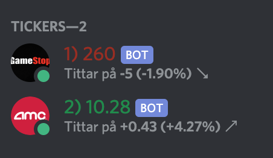

# Discord ticker bot

## About

A Discord bot that displays one or more stock tickers as users in the users panel.
The nickname is updated with the current market price and the activity is updated with the current change since open.



## Setup

#### Environment variables

Make a copy of `.env.example` and rename it to `.env` and make sure to add your own values to the properties.
It should look like this:

```
GME_BOT_TOKEN=
GME_BOT_TICKER=GME
AMC_BOT_TOKEN=
AMC_BOT_TICKER=AMC

POSITIVE_ROLE_ID=
NEGATIVE_ROLE_ID=
GUILD_ID=
```

Find out your `GUILD_ID` by opening discord in the browser and look at the url, there should be a long string of numbers.

You will get `POSITIVE_ROLE_ID` and `NEGATIVE_ROLE_ID` in the later section about how to configure the server roles for the tickers.

#### Setting up the roles in discord

The bots need a couple of roles to show up properly in discord, this is how I set it up in my discord.

1. Create a new Role that will be where your tickers show up in the users panel. I named it `Tickers`. Check `Show members separately from online members` to show it in the panel.
2. Make sure to give the `Tickers` role permission to manage roles and nicknames, all other permission can be off
3. Create two more roles, i named them `Positive` respectively `Negative` but you can name them whatever you want but make sure that the positive role has a positive color such as blue or green and the negative role has a negative color such as red.
   And remove all permissions from these roles, they don't need any.
4. Find out the id for the negative and positive roles by doing the following:
   In Discord write `\@Positive` and `\@Negative`, replace Positive and Negative with whatever names you chose for the roles.
   This will give you and id such as `<@&81962342343970688>`, take only the numbers from this text and add it to the `POSITIVE_ROLE_ID` and `NEGATIVE_ROLE_ID` respectively like so:
   ```
    POSITIVE_ROLE_ID=81962342343970688
    NEGATIVE_ROLE_ID=819623423439706123
   ```

#### Setting up a discord bot

For more information regarding discord bots, please see [the official discord docs](https://discord.com/developers/docs/intro).

1. Sign in and create a new application in the [discord application portal](https://discord.com/developers/applications) and give it a name, I used the ticker name as application name.
2. Go to Bot and create a bot for your application, give it the ticker as the name.
3. Invite the bot to the server you want it to show up in.
4. Add the previously created `Tickers` role to the bot
5. Repeat this for as many tickers as ypu want, one bot shows only one ticker at a time but can easily be updated with new a new ticker if needed.

Make sure to copy the bot token by pressing the `Copy` button under `Click to Reveal Token` and make sure you never commit this token to any repo or other people will hack your bot.

In the `.env` file create two lines as such:

```
{TICKER_NAME}_BOT_TOKEN={token goes here}
{TICKER_NAME}_BOT_TICKER={ticker goes here}
```

Replace `{TICKER_NAME}` with your ticker, for example `GME` for GameStop.

#### Adding a ticker to the bot

Open up `index.js` and add another object to the `bots` array like this:

```JavaScript
const bots = [
  {
    token: process.env.GME_BOT_TOKEN,
    ticker: process.env.GME_BOT_TICKER,
  },
  {
    token: process.env.{TICKER_NAME}_BOT_TOKEN,
    ticker: process.env.{TICKER_NAME}_BOT_TICKER,
  },
];
```

Make sure to replace `{TICKER_NAME}` with your actual ticker and that they are exactly like the properties you added in your `.env`.

#### Running the project

To run the project locally, install it using npm:

```
npm install
npm start
```

To apply changes automatically when a file is saved run the project in with nodemon:

```
npm run dev
```
